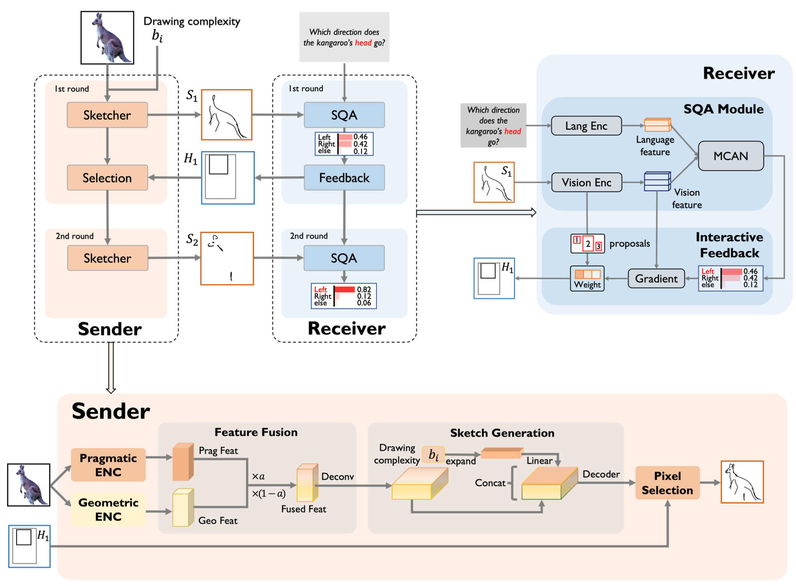
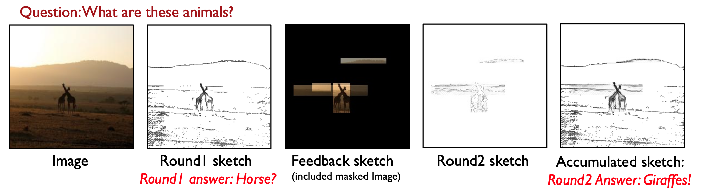

# ECISQA
[NeurIPS 2023] Emergent communication in interactive sketch question answering

<div>			<!--块级封装-->
    <center>	<!--将图片和文字居中-->
    
    <br>		<!--换行-->
    System Overview	<!--标题-->
    </center>
</div>

# Abstract

Vision-based emergent communication (EC) aims to learn to communicate through sketches and demystify the evolution of human communication. Ironically, pre- vious works neglect multi-round interaction, which is indispensable in human communication. To fill this gap, we first introduce a novel Interactive Sketch Question Answering (ISQA) task, where two collaborative players are interacting through sketches to answer a question about an image in a multi-round manner. To accomplish this task, we design a new and efficient interactive EC system, which can achieve an effective balance among three evaluation factors, including the question answering accuracy, drawing complexity and human interpretability. Our experimental results including human evaluation demonstrate that multi-round interactive mechanism facilitates targeted and efficient communication between intelligent agents with decent human interpretability.

# Visualization Results:

<div>			<!--块级封装-->
    <center>	<!--将图片和文字居中-->
    
    <br>		<!--换行-->
    Multi-round interactive SQA. From left to right we display RGB image, sketch transmitted in round 1, RGB image masked with Hi, extra pixels added in round 2, and the whole sketches in round 2.	<!--标题-->
    </center>
</div>


# Prerequistites

## Download [VQAV2](https://visualqa.org)

## Install [MCAN-VQA](https://github.com/MILVLG/mcan-vqa.git) requirements.

## [Install Detectron2](https://detectron2.readthedocs.io/en/latest/tutorials/install.html):

## Install [Bottom-Up-Attention](https://github.com/peteanderson80/bottom-up-attention)

## Install [Apex](https://github.com/NVIDIA/apex)

## Install [CLIP](https://github.com/openai/CLIP)


## Install ECISQA requirement:
```
conda env create -f envs/env.yml
conda activate detect_sketch
cd CLIP-main
python setup.py install
pip install -r envs/requirements.txt
```